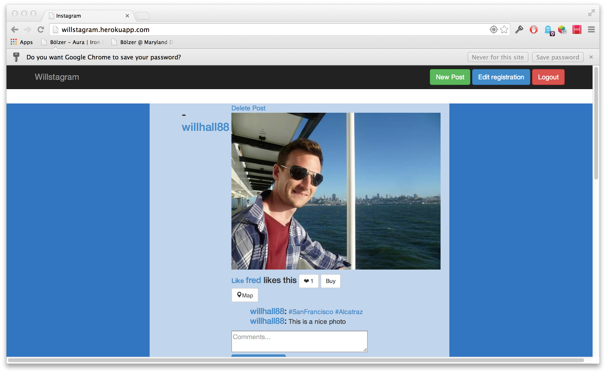

Instagram Clone
==================
This is a recereation of Instagram built on Ruby on Rails in Week 9 at Makers Academy.


The objectives of the project were to practice setting up a new app in Ruby on Rails including users, admins, a payment system and a mailing system. AJAX, Websockets and use of external API's were also involved. 

View the app on Heroku:[Willstagram]

Technologies Used
-----------------

- Ruby
- Ruby on Rails
- Postgresql
- Rspec
- Capybara
- Devise
- Paperclip
- Amazon Web Services
- Bootstrap
- Git
- Heroku
- Sendgrid
- Actionmailer
- Stripe
- Websockets
- jBuilder
- Javascript
- AJAX
- Google Maps API

How to run it
--------------
Ensure you have imagemagick installed. you can do this by running
`brew install imagemagick`

```
 git clone https://github.com/willhall88/instagram-recreation.git
 cd instagram-recreation
 bundle install
 bin/rake db:create db:migrate
 mailcatcher
 bin rails s
```

How to run tests
----------------

```
 git clone https://github.com/willhall88/instagram-recreation.git
 cd instagram-recreation
 bundle install
 bin/rake db:create db:migrate
 rspec	
```

[Willstagram]:http://willstagram.herokuapp.com/